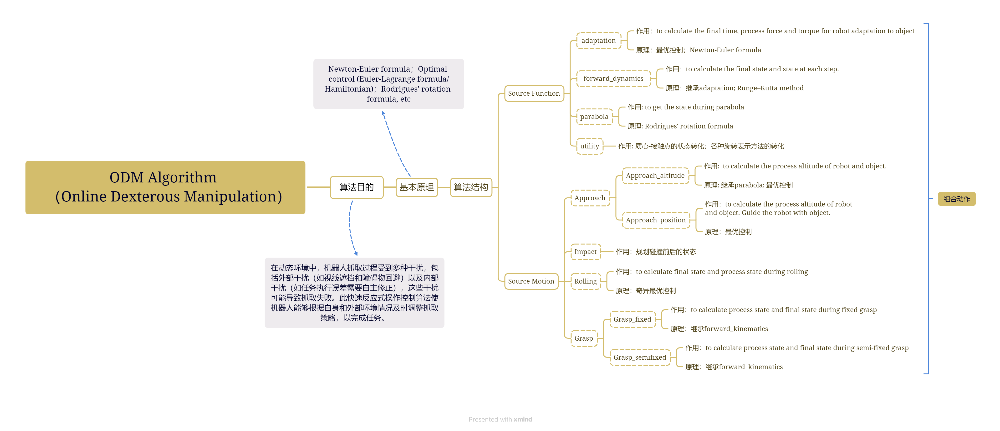

<h1 align="center">
   
  
   
  Dexterous Manipulation Online Planning Repo
   
</h1>

<!-- <h4 align="center">A minimal Markdown Editor desktop app built on top of <a href="http://electron.atom.io" target="_blank">Electron</a>.</h4> -->

  

  <a href="#key-features">Key Features</a> •
  <a href="#Contents">Contents</a> 

## Key Features

* Comprehensive and robust manipulation of objects
* Fast enough to support online computation and replanning

## Contents

- `source_function` folder is about the source code of the basic functions like `forward_dynamics.py`
- `source_motion` folder is about source motions which can be combined to form a task, including `approach`, `impact`, `rolling`, `sticking`, `grasping`
- `combined_motion` folder is about specific task achieved by combining different source motions.
- Repo structure:
  

- Demo of each source motion:
  - approach stage: to make robot approach the object in both position and orientation (blue is the object, yellow is the robot)
    
  - impact stage: to make robot impact the object 
    
  - rolling stage: to utilize robot to roll the object to a desired orientation
    
  - sticking stage: to make object stick to the robot end effector and move to a desired position and orientation
    
  - grasping stage: to make robot grasp the object, this demo is a fixed grasp, but the code can also support a moving grasp
    

<!-- ## Download

You can [download](https://github.com/amitmerchant1990/electron-markdownify/releases/tag/v1.2.0) the latest installable version of Markdownify for Windows, macOS and Linux.

## Emailware

Markdownify is an [emailware](https://en.wiktionary.org/wiki/emailware). Meaning, if you liked using this app or it has helped you in any way, I'd like you send me an email at <bullredeyes@gmail.com> about anything you'd want to say about this software. I'd really appreciate it!

## Credits

This software uses the following open source packages:

- [Electron](http://electron.atom.io/)
- [Node.js](https://nodejs.org/)
- [Marked - a markdown parser](https://github.com/chjj/marked)
- [showdown](http://showdownjs.github.io/showdown/)
- [CodeMirror](http://codemirror.net/)
- Emojis are taken from [here](https://github.com/arvida/emoji-cheat-sheet.com)
- [highlight.js](https://highlightjs.org/)

## Related

[markdownify-web](https://github.com/amitmerchant1990/markdownify-web) - Web version of Markdownify

## Support

Or
 

 -->

<!-- ## You may also like...

- [Pomolectron](https://github.com/amitmerchant1990/pomolectron) - A pomodoro app
- [Correo](https://github.com/amitmerchant1990/correo) - A menubar/taskbar Gmail App for Windows and macOS

## License

MIT

---

> [amitmerchant.com](https://www.amitmerchant.com) &nbsp;&middot;&nbsp;
> GitHub [@amitmerchant1990](https://github.com/amitmerchant1990) &nbsp;&middot;&nbsp;
> Twitter [@amit_merchant](https://twitter.com/amit_merchant) -->

